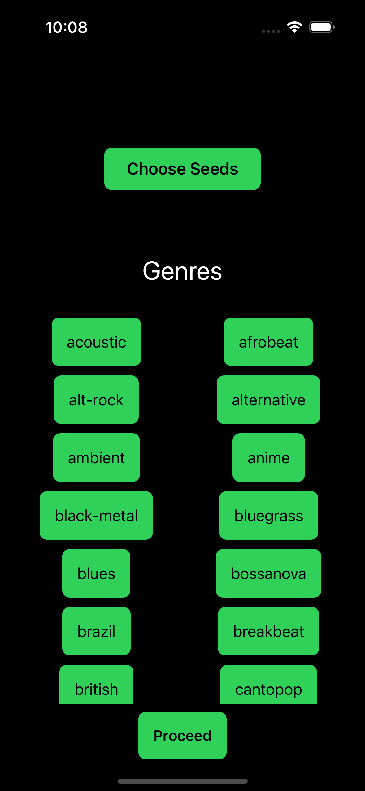
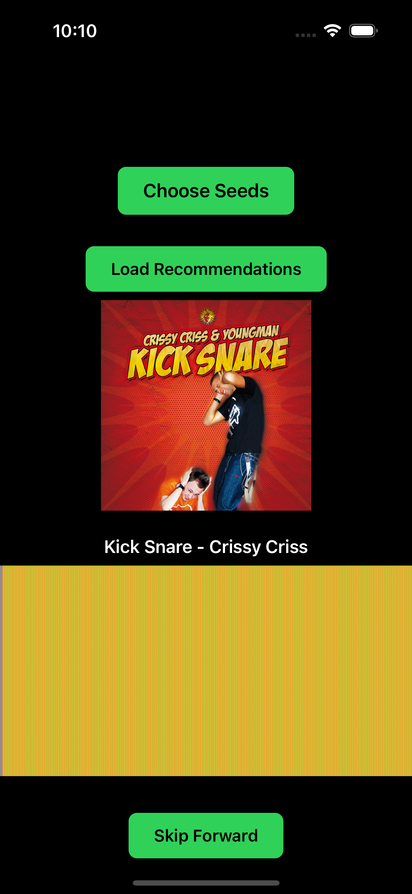

# Project Title:

Song Scout - The Ultimate Song Discovery App

## Team Members / Roles:

Nico Meiswinkle: Lead Developer

Reed Maniscalchi: Creative Director

Howie Li: Assistant Developer

Sam Biner: ChatGPT prompter, Code Copier, and Windows User

## User Audience and Needs:

Our chosen audience are Spotify users that are interested in finding new and undiscovered music from underground or unrecognized artists.

## Song Scout Screenshots:

## Technology Highlights:

Implementation of Spofity API for recommendations

Spotify API playback based on user's Spotify account

Use of Firebase to save the three most recent search result for users to reuse
if they like the recommendations

A Waveform that reacts with the music that is being played by the app currently

App icon of Jukebox (cuz why not?)

### Problems / Issues:

Spotify keeps giving us a 504 Gateway Timeout error, occurring on Postman as well with the same Headers and parameters

Inability to test Waveform iteratively since it only works when the Load Songs button works

### Future Features:

## Acknowledgements / Credits:

Google (of course)
ChatGPT (specifically GPT-4)
Hacking with Swift
Dondi (as always)

